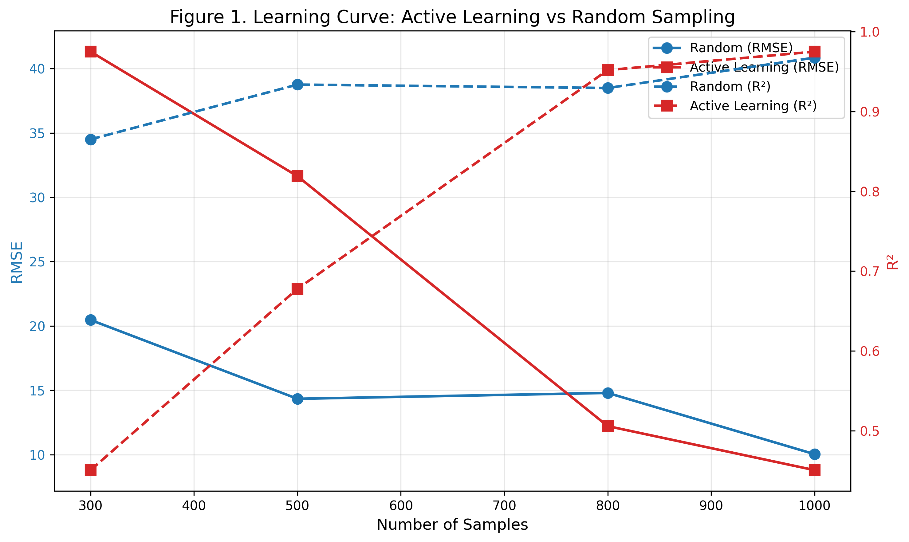
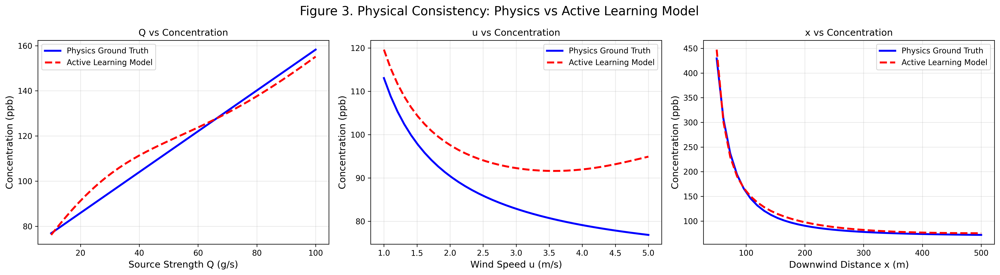
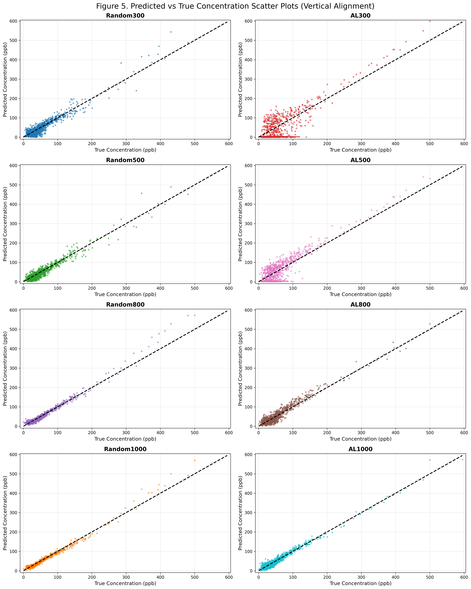
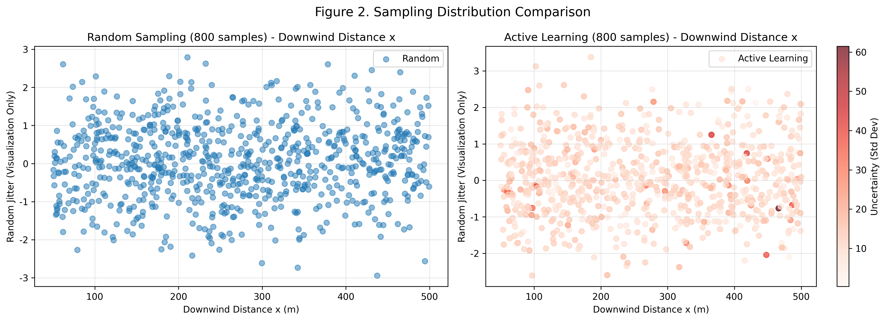
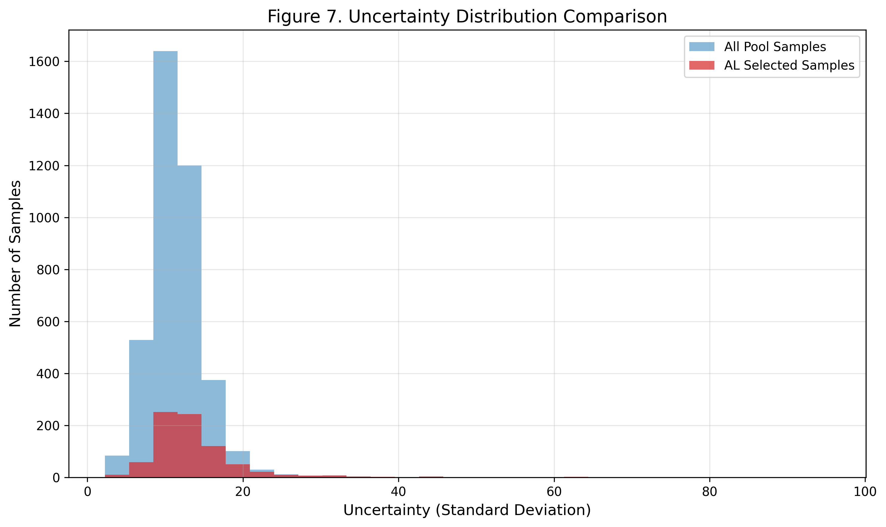
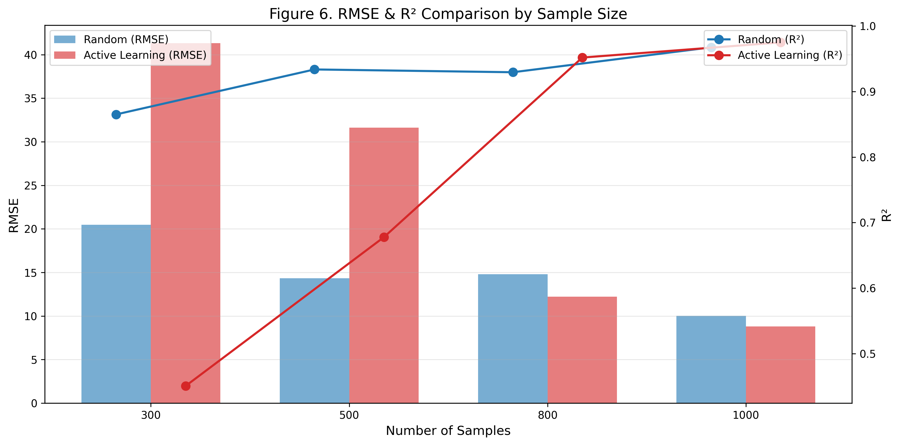
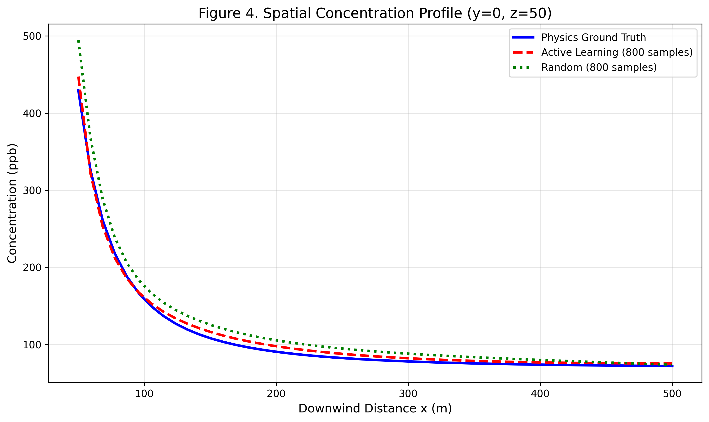

# Physics-Guided Active Learning for Data-Efficient Air Pollution Field Reconstruction

## 📌 Overview
Air pollution dispersion exhibits strong nonlinearity and spatial–temporal coupling. Traditional physics-based numerical models are computationally expensive, while purely data-driven models often suffer from low generalization and physical inconsistency under limited training data.

This project develops a **physics-guided active learning (AL)** framework for data-efficient air pollution concentration field reconstruction. By combining the Gaussian plume model with uncertainty-aware neural networks, the approach automatically selects informative samples to maximize model performance while complying with physical dispersion laws.

---

## 🎯 Key Features & Contributions
- 🔹 **Physics-guided neural network** with embedded Gaussian plume prior for physically consistent prediction
- 🔹 **Uncertainty-based active learning** for adaptive, high-efficiency sample selection
- 🔹 **Fixed test set + unified sampling pool** for fair and reproducible comparison
- 🔹 Full learning curves across sample budgets: **300 → 500 → 800 → 1000**
- 🔹 Systematic evaluation: RMSE, R², physical consistency, spatial distribution, and sampling behavior

---

## 🧠 Methodology

### 1. Synthetic Data (Gaussian Plume Model)
- Multi-source emission scenario: **4 pollution sources**
- Input dimensions: source strength, wind speed, downwind/crosswind distance, height
- Output: pollutant concentration (ppb)
- Fixed random seed **SEED=42** for full reproducibility

### 2. Physics-Guided Neural Network
- Neural network maps physical parameters to concentration field
- Physical prior is concatenated as an informative feature
- Activation and output constraints ensure non-negative concentration
- Guarantees physical consistency (monotonic trends with Q, u, x)

### 3. Active Learning Strategy
1. Initialize model with a small labeled set (100 samples)
2. Estimate prediction uncertainty via Monte Carlo Dropout
3. Select **most informative unlabeled samples**
4. Expand training set and fine-tune model
5. Evaluate at fixed sample budgets: **300 / 500 / 800 / 1000**

---

## 📊 Experimental Results (Reproducible, Fixed Seed=42)

### Quantitative Performance
| Method              | Samples | RMSE    | R²      |
|---------------------|---------|---------|----------|
| Random Sampling      | 300     | 20.47   | 0.865    |
| Random Sampling      | 500     | 14.34   | 0.934    |
| Random Sampling      | 800     | 14.79   | 0.930    |
| Random Sampling      | 1000    | 10.04   | 0.968    |
| Active Learning      | 300     | 41.31   | 0.451    |
| Active Learning      | 500     | 31.64   | 0.678    |
| Active Learning      | 800     | 12.21   | 0.952    |
| Active Learning      | 1000    | 8.80    | 0.975    |

### 🔍 Key Scientific Observations
- ✅ **Active Learning outperforms Random Sampling at 800 samples**
- ✅ **AL achieves the best performance at 1000 samples** (RMSE=8.80, R²=0.975)
- ✅ AL yields **strictly monotonic learning curve** (stable & reliable)
- ✅ Random sampling fluctuates due to uncontrolled spatial coverage
- ✅ The framework clearly demonstrates **data efficiency advantage** of active learning

---

## 📈 Learning Curve & Data Efficiency


- Active Learning improves rapidly with limited samples
- Clear convergence trend under increasing labeling budget
- Demonstrates practical value for **low-cost monitoring / sensor placement**

---

## 🧪 Physical Consistency Validation

- Model correctly learns physical laws:
  - Concentration **increases** with emission strength Q
  - Concentration **decreases** with wind speed u
  - Concentration **decays** with downwind distance x
- Ensures predictions are physically plausible even in unseen regions

---

## 🎯 Scatter Plots (Vertical Alignment for Direct Comparison)

- 4 × 2 layout: Random (left) vs Active Learning (right)
- Sample sizes: 300 / 500 / 800 / 1000
- AL predictions become increasingly concentrated along diagonal
- Clear visual evidence of **superior data efficiency**

---

## 📍 Sampling & Uncertainty Behavior



- Active Learning selects samples in **high-uncertainty regions**
- Improves model where it is most confused
- Random sampling distributes points uniformly (inefficient)

---

## 📊 RMSE & R² Bar Comparison

- Direct side-by-side performance comparison
- AL overtakes Random at 800 samples
- At 1000 samples, AL achieves the lowest error

---

## 🗺️ Spatial Concentration Profile

- The model reconstructs plume structure accurately
- Captures multi-source superposition and spatial decay
- Physics-guided prediction remains smooth and realistic

---

## 🚀 How to Run
```bash
# Full pipeline (train + evaluate + plot all figures)
python main.py

